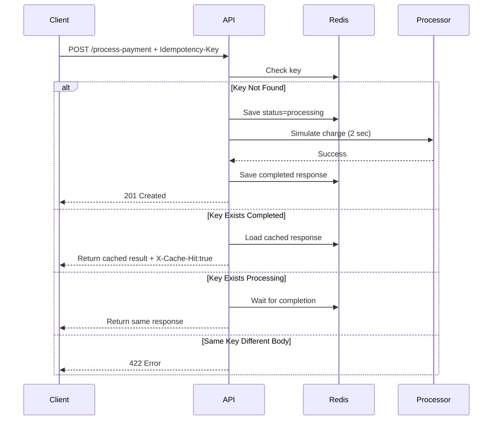

# Idempotency Gateway (Pay Once Protocol)

A payment protection API that prevents duplicate charging when clients retry requests.

---

# Architecture Diagram



---

# Sequence Diagram

```mermaid
sequenceDiagram
    autonumber
    actor C as Client System
    participant S as Idempotency Gateway (Server)
    participant DB as Idempotency Store (Redis)
    participant BANK as Core Bank API (Simulation)

    Note over C, S: User Story 1: The First Transaction (Happy Path)
    
    C->>S: POST /process-payment {amt: 100} <br/> Header: Idempotency-Key: "key_abc_123"
    
    Note over S, DB: Atomic check-and-set (e.g., SETNX in Redis)
    S->>DB: Check if "key_abc_123" exists
    DB-->>S: Key does not exist.
    
    S->>DB: SET "key_abc_123" status="PROCESSING" (with TTL)
    
    Note over S, BANK: Simulate processing delay (2 seconds)
    S->>BANK: Process Charge for 100
    BANK-->>S: Success (Charge ID: ch_1)
    
    Note over S, DB: Store the response final state
    S->>DB: UPDATE "key_abc_123" status="COMPLETED", response={"msg": "Charged 100", "id": "ch_1"}
    
    S-->>C: 200 OK {"msg": "Charged 100", "id": "ch_1"}

    Note over C, S: User Story 2: The Duplicate Attempt

    C->>S: POST /process-payment {amt: 100} <br/> Header: Idempotency-Key: "key_abc_123"
    
    S->>DB: Check "key_abc_123"
    DB-->>S: Exists. Status="COMPLETED". Payload={...}
    
    Note over S: Detected COMPLETED state.<br/>DO NOT call BANK API.
    
    S-->>C: 200 OK {"msg": "Charged 100", "id": "ch_1"} <br/> Header: X-Cache-Hit: true

    Note over C, S: User Story 6: The "In-Flight" Check (Race Condition)

    par Request A (Arrives slightly first)
        C->>S: POST ... Header: Idempotency-Key: "key_xyz"
        S->>DB: SETNX "key_xyz" to "PROCESSING"
        DB-->>S: OK (Lock Acquired)
        S->>BANK: Start Processing...
    and Request B (Arrives during A's processing)
        C->>S: POST ... Header: Idempotency-Key: "key_xyz"
        S->>DB: SETNX "key_xyz" to "PROCESSING"
        DB-->>S: FAIL (Key already exists)
        
        Note right of S: Request B must wait or poll.<br/>We assume polling DB status here.
        
        loop Polling DB status
            S->>DB: GET status of "key_xyz"
            DB-->>S: "PROCESSING"
        end
    end

    Note over S, BANK: Request A finishes BANK call
    BANK-->>S: A Success
    S->>DB: UPDATE "key_xyz" to "COMPLETED", Payload={...}
    S-->>C: (Return Request A) 200 OK

    loop Next Poll by Request B thread
        S->>DB: GET status of "key_xyz"
        DB-->>S: "COMPLETED", Payload={...}
    end
    
    S-->>C: (Return Request B) 200 OK

---

# Setup Instructions

## Run with Docker

```bash
docker compose up --build
```

API runs at:

```bash
http://localhost:8000
```

Swagger Docs:

```bash
http://localhost:8000/docs
```

---

# API Documentation

## POST /process-payment

### Headers

```http
Idempotency-Key: abc123
```

### Body

```json
{
  "amount": 100,
  "currency": "GHS"
}
```

### First Response

```json
{
  "message": "Charged 100 GHS"
}
```

Status: `201 Created`

---

### Duplicate Request

Same key + same payload:

Returns instantly:

Header:

```http
X-Cache-Hit: true
```

---

### Fraud / Mismatch Request

Same key + different payload:

```json
{
  "detail": "Idempotency key already used for a different request body."
}
```

Status: `422`

---

## GET /metrics

Returns:

```json
{
  "processed": 1,
  "cache_hits": 2,
  "conflicts": 1
}
```

---

# Design Decisions

## Redis Chosen Because:

- Atomic operations (`SETNX`)
- Fast lookups
- TTL expiry
- Real-world fintech suitability

## Request Hashing

SHA256 of request body ensures same key cannot be reused for different payments.

## In-Flight Protection

If two requests arrive simultaneously:

- First starts processing
- Second waits
- Both receive same final result

---

# Developer's Choice Feature

## TTL Expiry (24 Hours)

Idempotency keys automatically expire after 24 hours.

Why?

Real systems should not store payment keys forever.

Benefits:

- Lower memory usage
- Better operational hygiene
- Realistic payment gateway behavior

---

# Example Test

```bash
curl -X POST http://localhost:8000/process-payment \
-H "Content-Type: application/json" \
-H "Idempotency-Key: test123" \
-d '{"amount":100,"currency":"GHS"}'
```

Run same command again to test replay.

---

# Author

Waako Shadidu Ismail
