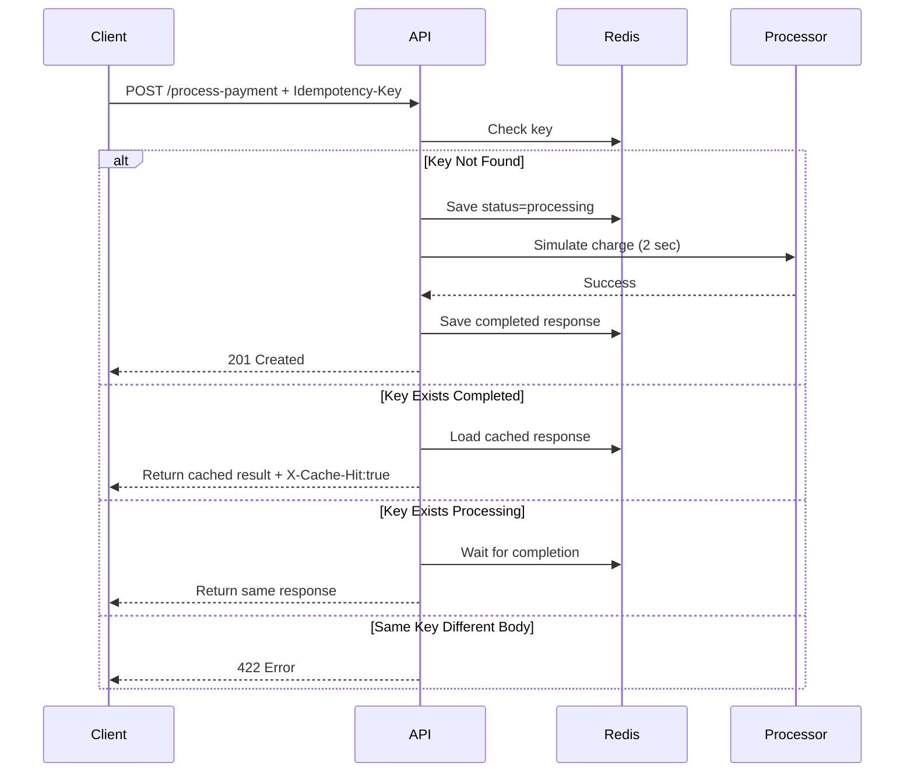

# Idempotency Gateway (Pay Once Protocol)

A payment protection API that prevents duplicate charging when clients retry requests.

---

# Architecture Diagram



---

# Setup Instructions

## Run with Docker

```bash
docker compose up --build
```

API runs at:

```bash
http://localhost:8000
```

Swagger Docs:

```bash
http://localhost:8000/docs
```

---

# API Documentation

## POST /process-payment

### Headers

```http
Idempotency-Key: abc123
```

### Body

```json
{
  "amount": 100,
  "currency": "GHS"
}
```

### First Response

```json
{
  "message": "Charged 100 GHS"
}
```

Status: `201 Created`

---

### Duplicate Request

Same key + same payload:

Returns instantly:

Header:

```http
X-Cache-Hit: true
```

---

### Fraud / Mismatch Request

Same key + different payload:

```json
{
  "detail": "Idempotency key already used for a different request body."
}
```

Status: `422`

---

## GET /metrics

Returns:

```json
{
  "processed": 1,
  "cache_hits": 2,
  "conflicts": 1
}
```

---

# Design Decisions

## Redis Chosen Because:

- Atomic operations (`SETNX`)
- Fast lookups
- TTL expiry
- Real-world fintech suitability

## Request Hashing

SHA256 of request body ensures same key cannot be reused for different payments.

## In-Flight Protection

If two requests arrive simultaneously:

- First starts processing
- Second waits
- Both receive same final result

---

# Developer's Choice Feature

## TTL Expiry (24 Hours)

Idempotency keys automatically expire after 24 hours.

Why?

Real systems should not store payment keys forever.

Benefits:

- Lower memory usage
- Better operational hygiene
- Realistic payment gateway behavior

---

# Example Test

```bash
curl -X POST http://localhost:8000/process-payment \
-H "Content-Type: application/json" \
-H "Idempotency-Key: test123" \
-d '{"amount":100,"currency":"GHS"}'
```

Run same command again to test replay.

---

# Author

Waako Shadidu Ismail
